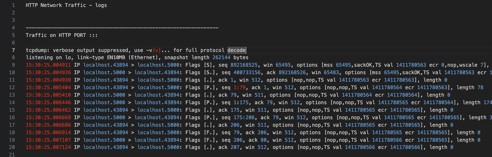
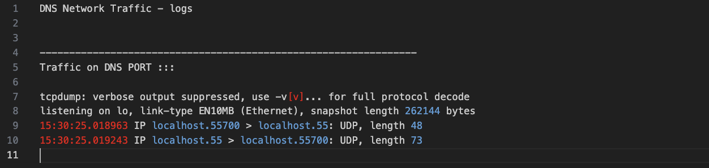

# toy.net-servers

toy.net-servers provides simplified implementations of DNS and HTTP servers with tools to observe and compare their communication patterns.  

## Motivation

I was watching a podcast with Dr. Kailash Nadh , where he explained about the project toy.dns .It made me to think deeper on what happen behind the scenes. This project can help you understand why HTTP is considerd as "Heavy" compared to DNS.

## Documentation

The main objective is to "see" the network-traffic when different types of servers serves their corresponding requests. I have written a bash script (run.sh) which will automate following steps:

    - Run a toy HTTP server.
    - Run a toy DNS server.
    - Send a request to the HTTP server (with curl command).
    - Send a request the DNS server (with dig command).
    - Using the "tcpdump" framework , log the HTTP traffic to logs/http_network_logs.log file.
    - Using the "tcpdump" framework , log the DNS traffic to logs/dns_network_logs.log file.

## Usage

    1. Clone the repository.
    2. Create a virtual environment.
    3. Activate the virtual environment.
    4. Install the dependencies.
    5. run ./run.sh in the terminal.
    6. Check the results in the logs folder.The folder contain logs corresponding to the following:
        - dns_server log
        - http_server log
        - dns_network log
        - http_network log

## Results:

    - Network Traffic @ the HTTP Port after the request:
    

    - Network Traffic @ the DNS Port after the request:
    

## Learnings/ Observations:

    > HTTP is a framework builded on TCP, and DNS uses UDP. The result is a representative of the same.  
    > You could see around 12 packets are involed while serving an HTTP request while only 2 in the case of a DNS server.
    > For small queries like "temperature in banglore" where the response is "small" (I mean payload is small, as it is just a string) instead of "heavy" loads  (html files,images .. usual element types in the response payload) , why to involk complex HTTP servers  to serve these "small" requests (Ofcouse the DNS server need to be rewritten according to the usecase !! )

     

## Citations/reference frameworks:

    1. akapila011/DNS-Server.git
    2. tcpdump framework.
    3. knadh/dns.toys.git
    4. ofcourse ChatGPT and Perplexity.
